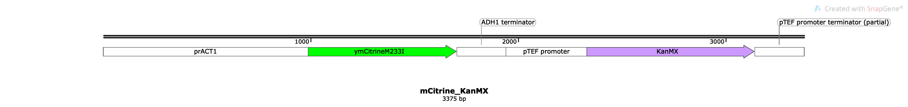
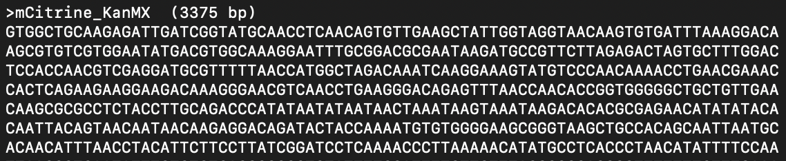
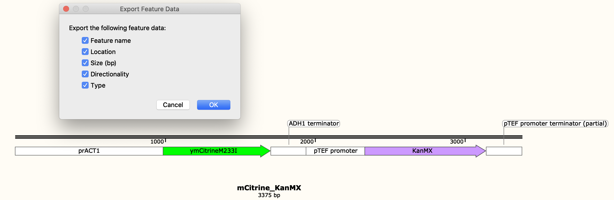
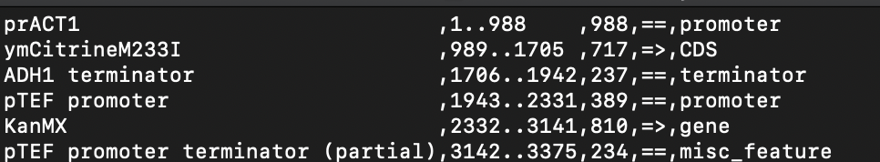
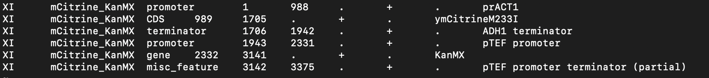
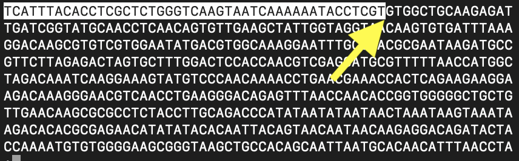

```{r setup, include=FALSE}
knitr::opts_chunk$set(
  tidy = TRUE,
  tidy.opts = list(width.cutoff = 120),
  message = FALSE,
  warning = FALSE
)
```

In this vignette we demonstrate how to construct customized genome and annotation files using *ref*orm.

In this example, we will add a small construct that contains the fluorescent protein gene, mCitrine, and a selectable marker, kanMX and specify it's integration proximate to the *GAP1* locus in yeast.

## Step 1: Generating input files

In our lab, we use Snapgene to generate the map of the novel sequence and the corresponding sequence in fasta format.  The Export Feature Data function in snapgene requires a registered copy, so alternative tools should be used if this is not available.

### Novel features map

This map includes all annotated features in the novel DNA.  Inclusion of these annotations ensure that they will appear in the GFF. 

```{r, echo=FALSE, fig.cap="Novel sequence map", out.width = '150%'}

```

### Novel sequence

The sequence corresponding to the novel features should be in fasta format.

```{r, echo=FALSE, fig.cap="Novel fasta", out.width = '10%'}

```

### Generating the annotation file for novel features.

This is a two step process.  

#### First, the list of features are exported from snapgene.

`Features -> Export Feature Data...`

```{r, echo=FALSE, fig.cap="Export features", out.width = '100%'}

```

the exported file should be saves as a `.csv`

```{r, echo=FALSE, fig.cap="Export features", out.width = '100%'}

```

#### Second, use the `gff_from_snapgene_features()` function to create a gff

The first time the code is run you will need to download and install labtools from github using the following code:

```{r, echo=TRUE}
#library(devtools)
#install_github("GreshamLab/labtools")
```

Once installed, use the `make_gff_from_snap` function to generate the correctly formatted gff.

To learn more about the function use `?make_gff_from_snap`

```{r echo=TRUE, message=FALSE, warning=FALSE}
library(labtools)
labtools::make_gff_from_snap("Features_from_mCitrine_KanMX.csv", chromosome = "XI", feature_source = "mCitrine_KanMX", output = "./mCitrine_KanMX_GAP1.gff")
```

The resulting gff be correctly formmated and should look like this:

```{r, echo=FALSE, fig.cap="Export features", out.width = '100%'}

```

## Step 2: Generating a *ref*ormed genome.

The next step is to use the novel gff and novel fasta files as input to *ref*orm, which will modify the reference genome to insert them and generated genome and annotation files the incorporate the new features. In this case we will provide a unique upstream sequence as a fasta file and a unique downstream sequence as a fasta file. reform will identify the insertion site using these sequences. 
```{bash}
less up.fa
echo
less down.fa
```

We now run reform providing values for all the required variables.  It is also possible to specify the coordinate for the insertion site. Details on running *ref*orm can be found [here](https://gencore.bio.nyu.edu/reform/)


```{bash eval=FALSE, echo=TRUE}
module load reform/1

reform.py \
  --chrom="XI" \
  --upstream_fasta="Data/up.fa" \
  --downstream_fasta="Data/down.fa" \
  --in_fasta="Data/mCitrine_KanMX.fa" \
  --in_gff="Data/mCitrine_KanMX_GAP1.gff" \
  --ref_fasta="/scratch/work/cgsb/genomes/Public/Fungi/Saccharomyces_cerevisiae/Ensembl/R64-1-1/Saccharomyces_cerevisiae.R64-1-1.dna.toplevel.fa" \
  --ref_gff="/scratch/work/cgsb/genomes/Public/Fungi/Saccharomyces_cerevisiae/Ensembl/R64-1-1/Saccharomyces_cerevisiae.R64-1-1.34.gff3"

```

```{bash, echo=False}
echo No valid position specified, checking for upstream and downstream sequence
echo Proceeding to insert sequence 'mCitrine_KanMX  (3375 bp)' from Data/mCitrine_KanMX.fa at position 513945 on chromsome XI
echo New fasta file created:  Saccharomyces_cerevisiae.R64-1-1.dna.toplevel_reformed.fa
echo Preparing to create new annotation file
echo New .GFF3 file created: Saccharomyces_cerevisiae.R64-1-1.34_reformed.gff3 
```


## Step 3: Confirm files have been modified correctly.

The reformed GFF contains the new features at the appropriate location:


```{r, echo=FALSE, fig.cap="Novel fasta", out.width = '10%'}
knitr::include_graphics("reformed_gff.png")
```


And the reformed fasta contains the novel sequence at the appropriate location, which is adjacent to the upstream sequence

```{bash}
less up.fa
```

```{r, echo=FALSE, fig.cap="Novel fasta", out.width = '10%'}

```


