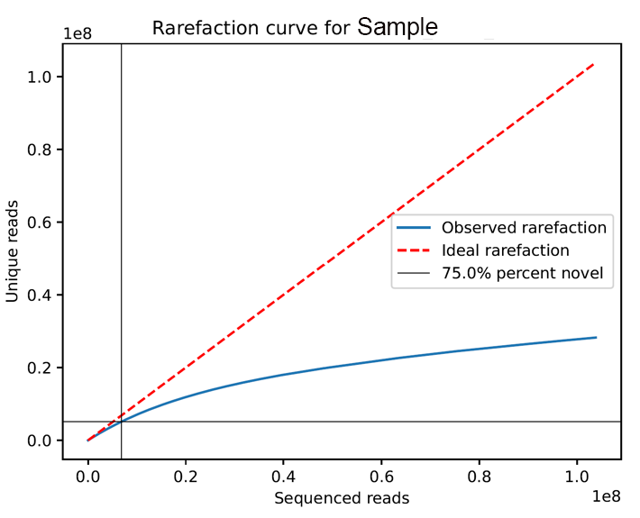

```{r setup, include=FALSE}
knitr::opts_chunk$set(echo = TRUE)

```
#### Purpose
This pipeline is intended to: 

* trim and align paired-end RNAseq reads with UMIs (presumably produced by Lexogen CORALL library prep kit)
* deduplicate reads using UMIs
* calculate UMI duplication and rRNA contamination
* calculate unnormalized read coverage per feature for all samples (intended for use in DESeq2 analysis) 

As the lab is beginning to shift towards running many of these libraries a simple python script was produced to automate much of the repetition in this process.

#### Requirements
This document assumes you ran paired-end RNAseq with UMIs and have access to the FASTQ files. 

This document heavily focuses on using a small python script called Windchime to handle sbatch shell generation. When ran it will generate two sbatch shell scripts. The first script will align reads using STAR and deduplicate reads using UMI-tools. The second sbatch shell script uses bedtools genomecov to calculate read coverage for each genome feature. 

#### Step zero - Set up environment
* __UMI-Tools__ For UMI-tools you will need to activate a python 3.8 environment with UMI-tools installed:
  ```
  conda create -n umi_tools python=3.8
  conda activate umi_tools
  conda install -c bioconda umi_tools
  ```

* __Windchime__ You will also need the windchime script which is available here:
  ```
  git clone https://github.com/pspealman/windchime.git
  cd windchime
  pwd
  ```
  This is a standalone script which requires only the standard python (3.6+) packages. You can always use it by pointing to the directory printed out above or by copying the script into a preferred folder. 

* __srun__ Steps 3, 4, and 6 can consume significant computational resources in order to preserve these resources on the login nodes you should enter an interactive session on a computational node using srun. 
  ```
  srun -c 1 -t 12:00:00 --mem 100000 --pty /bin/bash
  ```
  __NB__ these srun parameters may need to be modified for smaller or larger datasets. If you complete steps 3,4, and 6 you can close your session by typing ```exit```

#### Step one - Setup configuration File

Windchime uses a __tab delimited__ configuration file to define necessary parameters and samples for the run. These come in two varieties: samples with replicates (Table 1) and without (Table 2). 

Each table requires the same kinds of run parameters (noted as 'meta' in column 1). Lines can be commented out by using a hash '#' character at the start of the line.

* set_name - user defined name
* data_dir - where the fastq files are stored
* work_dir - where the temporary and run files are stored
* output_dir - where the final results are output
* genome_fa - reference fasta file (you may need to copy it locally for indexing issues)
* genome_features - either GFF, GFF3, or GTF format file
* intron_max - size in nucleotides of maximum intron
* adapter_seq_R1, adapter_seq_R2 - read 1 and read 2 adapter sequences
* prefix - run id, usually supplied by the sequencing core (eg. HGG..., HGK..., etc.)
* fastq_name_template - since the files generated by genore have all kinds of file name conventions there may be several ways your fastq files incorporate the information of the run id (prefix), strain or sample (strain) and replicate (replicate). This line allows you to set these parameters using a simple formatting option using curly brackets containing the keywords 'prefix', 'strain', or replicate (if you are using the replicate format). 
* qc_locus - locus coordinates for calculation of rRNA contamination (eg. chromosome:start-stop)
 
  ```
  for Saccharomyces cerevisiae S288C R64: XII:451439-468985
  for Candida albicans SC 5314 A22: Ca22chrRA_C_albicans_SC5314:1891108-1896912
  ```
* sample - unique sample name (if replicates are being used the sample name and replicate ID combined must be unique)
 
#### Table 1 - Example of configuration file for samples with replicates
```
#data_type	variable	value
meta	set_name	Project_Windchime_HGG72DRXY
meta	data_dir	/scratch/cgsb/gencore/out/Gresham/2021-08-09_HGG72DRXY/merged/
meta	work_dir	/scratch/cgsb/gresham/LABSHARE/Data/HGG72DRXY/
meta	output_dir	/scratch/cgsb/gresham/LABSHARE/Data/HGG72DRXY/results/
meta	genome_fa	/scratch/cgsb/gresham/pieter/genome/ensembl_50/Saccharomyces_cerevisiae.R64-1-1.dna.toplevel.fa
meta	genome_features	/scratch/cgsb/gresham/pieter/genome/Saccharomyces_cerevisiae.R64-1-1.dna.toplevel.gtf
meta	intron_max	100
meta	adapter_seq_R1	AGATCGGAAGAGCACACGTCTGAACTCCAGTCA
meta	adapter_seq_R2	AGATCGGAAGAGCGTCGTGTAGGGAAAGAGTGT
meta	prefix	HGG72DRXY
meta	fastq_name_template	{prefix}_n01_{strain}_{replicate}
meta	qc_locus  XII:451439-468985
sample	1	1
sample	1	2
sample	1	3
sample	1222	1
sample	1222	2
sample	1222	3
```

#### Table 2 - Example of configuration file for samples without replicates
```
#data_type	variable	value
meta	set_name	Project_CAlbicans
meta	data_dir	/scratch/cgsb/gencore/out/Gresham/2021-10-25_HK7CCDRXY/merged/
meta	work_dir	/scratch/cgsb/gresham/LABSHARE/Data/HK7CCDRXY/
meta	output_dir	/scratch/cgsb/gresham/LABSHARE/Data/HK7CCDRXY/results/
meta	genome_fa	/scratch/cgsb/gresham/pieter/genome/Candida_albicans_sc5314/C_albicans_SC5314_A22_current_chromosomes.fasta
meta	genome_features	/scratch/cgsb/gresham/pieter/genome/Candida_albicans_sc5314/C_albicans_SC5314_A22_current_features.gff
meta	intron_max	500
meta	adapter_seq_R1	AGATCGGAAGAGCACACGTCTGAACTCCAGTCA
meta	adapter_seq_R2	AGATCGGAAGAGCGTCGTGTAGGGAAAGAGTGT
meta	prefix	HK7CCDRXY
meta	fastq_name_template	{prefix}_n01_{strain}
meta	qc_locus	Ca22chrRA_C_albicans_SC5314:1891108-1896912
sample	CAWT1_C-LIM_2H
sample	CAWT1_C-LIM_5H
```
#### Step two - Make STAR alignment sbatch file
```
python windchime.py -a -i cfg_file.tab -o run_windchime_star.sh
# -a 'alignment' flag
# [optional] -rep flag, include if you ar using replicates
# [optional] -mem flag, set sbatch memory allocation in GB. (Default 60GB)
# -i input configuration file name
# -o output STAR sbatch file name

sbatch run_windchime_star.sh
```
* The above code will generate a __bash script "run_windchime_star.sh"__ using the information given in the __-i__ input configuration file. _If being used with replicates include the -rep flag_


#### Step three - Evaluate summary performance statistics
```
python windchime.py -e -i cfg_file.tab -o evaluate_run.txt
# -e 'evaluate' flag
# [optional] -rep flag, include if you ar using replicates
# -i input configuration file name
# -o output evaluation statistics file name
```
* The above code will compile the qc stats generated during __step two__ and output them into a tab delimited summary file.

* This will output a tab delimited file with the following columns:
  ```
  Strain  Replicate  Total_reads  UMI_unique_reads  UMI_unique_pct  QC_locus_reads  QC_locus_pct
  DGY1    1   30908838    13035713    0.421747107   6006389   0.460764133
  DGY1    2   31273142    13166811    0.421026164   4246728   0.322532768
  ...
  ```
* UMI_unique_reads are calculated after deduplication using UMI-tools, they represent the __unique reads__.
* UMI_unique_pct is (UMI_unique_reads / Total_reads) * 100
* QC_locus_reads are calculated from the unique reads aligned to the QC_locus defined in the configuration file (Step one)
* QC_locus_pct is (QC_locus_reads / UMI_unique_reads) * 100

#### Step four - Calculate sequence rarefaction
```
python windchime.py -r -i ctrl_file.tab
# -r 'rarefaction' flag
# [optional] -rep flag, include if you ar using replicates
# [optional] -tol parameter, allows you to specify the percent tolerance point (default 50)
# -i input configuration file name
```
* The above code will perform a rarefaction calculation using the combination of
UMI an aligned sequence. All rarefaction is calculated using random downsampling. 
* This command will produce rarefaction curves saved as .pdf files in the __output_dir__ directory specified in the configuration file.

* The plot will show both the __ideal case__ (red, dashed line), the __observed case__ (blue solid curve), and the approximate __tolerance point__ if present (black solid lines). 
* The tolerance point, by default 50%, is the point at which the rate of adding a novel sequence drops below 50% (this can be changed by using the __-tol__ parameter). In the above example, a 75% tolerance point is crossed very early in the run (~0.7e8 reads). 

#### Step five - Calculate coverage of aligned reads to genome features
```
python windchime.py -c -i cfg_file.tab -o coverage_run.sh
# -c 'coverage' flag
# [optional] -rep flag, include if you ar using replicates
# [optional] -mem flag, set sbatch memory allocation in GB. (Default 60GB)
# -i input configuration file name
# -o output coverage sbatch file name

sbatch coverage_run.sh
```
* The above code will generate a __bash script "coverage_run.sh"__ using the information given in the __-i__ input configuration file.
* Coverage is calculated using __bedtools -genomecoverage__ command with default settings. The feature file specified by __'genome_features'__ in the configuration file will be used for all calculations.

#### Step six - combine feature coverage counts into a single table
```
python windchime.py -t -i cfg_file.tab -o coverage_table.txt
# -t 'table' flag
# [optional] -rep flag, include if you ar using replicates
# -i input configuration file name
# -o output combined coverage table file name
```

* This will produce a tab-delimited file where columns are the sample identifier and rows are the feature (eg. gene) name.   All values are uncorrected, unnormalized, deduplicated reads. Both paired reads must be 100% within the same feature in order to be counted. This table is compatible with downstream analysis by DESeq2

  ```
  gene	DGY1-1	DGY1-2	DGY1-3    ...
  YAL001C	737	894	677
  YAL002W	825	1067	878
  YAL003W	4268	4369	6463
  ...
  ```

#### Conclusion 
After a successful run you should have the following files:

* In the configuration specified output directory (eg. __output_dir__):
  + Aligned, sorted, indexed bam files
  + Rarefaction curve plots
  + Raw coverage count files

* Command line specified locations (eg. __-o__):
  + Quality control evaluation
  + Combined coverage table
